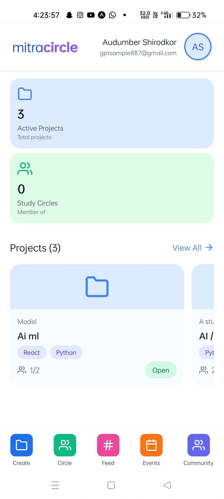
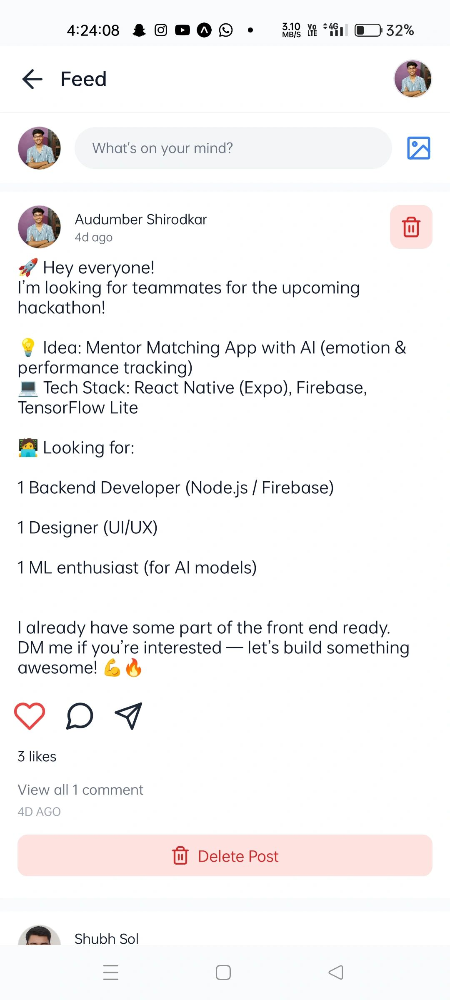
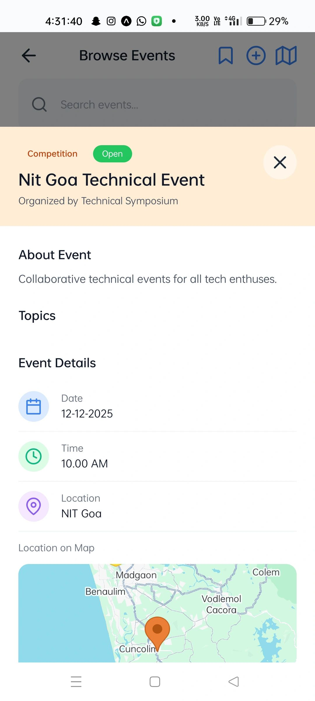
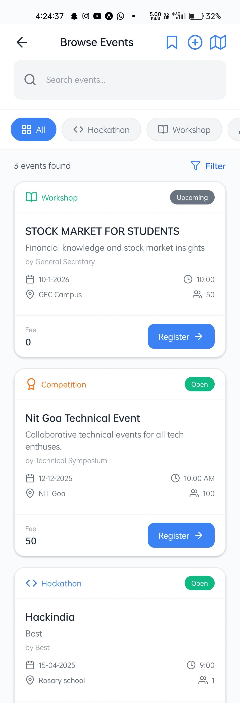
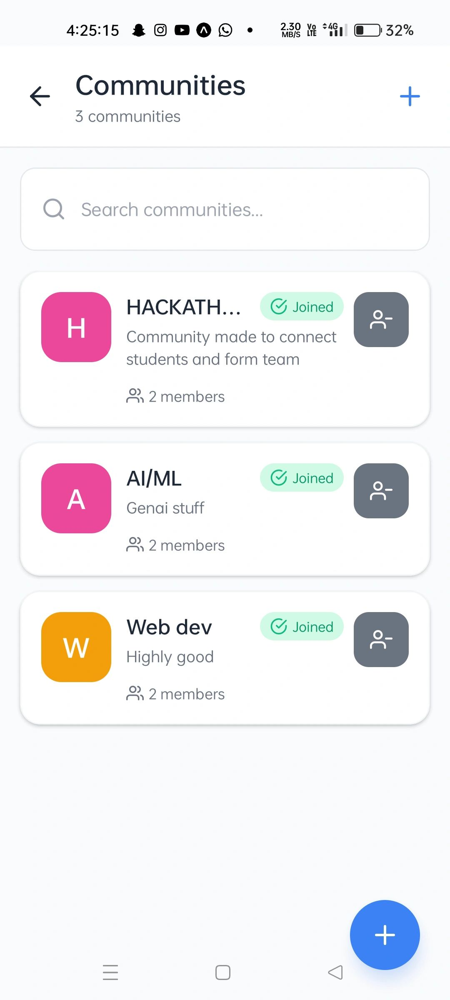
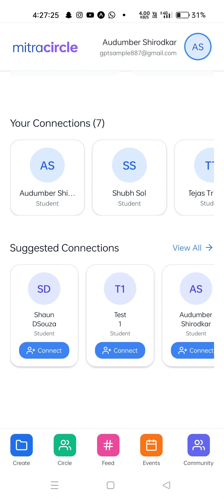
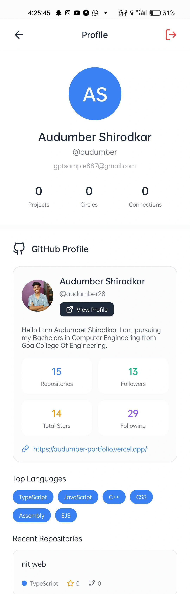
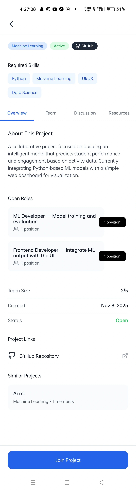
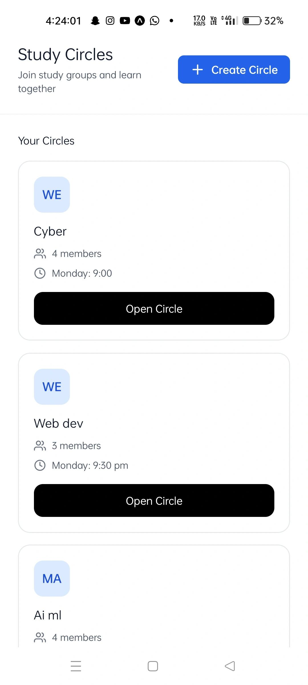

🚀 MitraCircle – Hackathon Winning Project

 🏆 <b>Track Winner</b> at <b>Tech-Tonics (24-hour Hackathon)</b>  Organized by <b>NIT Goa</b> in collaboration with <b>GDG NIT Goa</b> 

📌 Overview

MitraCircle is a mobile application designed to help students connect, collaborate, and grow together.

It bridges the gap between:

💼 LinkedIn’s professionalism
🌐 Social media’s chaos

➡️ By creating a focused, student-first collaboration platform

✨ Key Features
Feature	Description
🔍 Discover Projects	Find and join exciting projects
🤝 Team Building	Connect with students with matching skills
📍 Event Discovery	Explore hackathons & tech events
💼 Profile Showcase	Display GitHub & skills
🎟️ Hackathon Listings	Stay updated with opportunities
💬 Collaboration Dashboard	Manage teamwork efficiently
🧠 Tech Stack

Frontend
React Native

Backend
Firebase

Media
Cloudinary

AI
Chat + Team Matching

## 📱 App Screenshots

  
  
  

  
  
  

  
  
  

⚡ Hackathon Journey

Built from scratch in just 24 hours:

💭 Intense brainstorming
☕ Lots of caffeine
💻 Non-stop coding
🚀 What We Learned
Real-world teamwork
Rapid problem-solving
Execution under pressure
Belief in bold ideas
👥 Team

 <b>Shubh Solanki</b> • <b>Shaun D'Souza</b> • <b>Audumber Shirodkar</b> 

